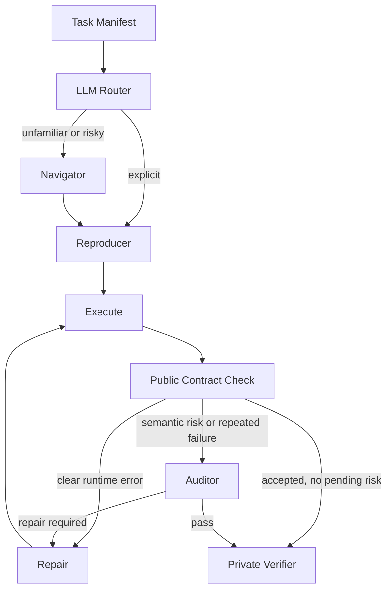

# Repro-Agent

[English](README.md) | [中文](README.zh-CN.md)

Repro-Agent is a **blind, adaptive multi-agent runtime for reproducing ML repository results**. Agents inspect a public task and repository, generate an evaluation program, execute it, and repair from real failures. A separate fail-closed verifier recomputes the metric from per-sample artifacts; targets and gold labels never enter agent context.

The current runtime has one production path: `adaptive`. Historical `solo`, `solo-repair`, and `full` modes remain only as ablation evidence for execution feedback, role specialization, and selective orchestration.

| Historical evidence | Result |
|---|---:|
| `solo` → `solo-repair` → `full` | **7/20 → 14/20 → 17/20** verifier passes |
| OpenOOD, `solo` → `full` | **0/5 → 4/5** verifier passes |
| Six-task full coverage | **27/30** verifier passes |
| Post-freeze STS-B held-out task | **5/5** verified and workflow-clean |

See [evals/RESULTS.md](evals/RESULTS.md) for costs and failures. Removed pipeline implementations are archived at Git tag `legacy-pipelines-v1`; exact experiment commits, diff hashes, and assets are recorded in [evals/FREEZE.md](evals/FREEZE.md).

## Current Architecture



- **Router** submits one structured Function Calling risk plan, with deterministic fallback.
- **Navigator** investigates entry points, assets, and metric semantics only when needed.
- **Reproducer** writes the complete evaluation program and per-sample artifact.
- **Auditor** checks source evidence for semantic risk or unknown/repeated failures.
- **Repair** patches from real logs and public diagnostics within a five-execution budget.
- **Verifier** reads private gold only after the workflow and independently recomputes once.

## Manifest-First Tasks

Every benchmark enters through `evals/tasks/*.yaml`, [evals/catalog.py](evals/catalog.py), and [evals/manifest.py](evals/manifest.py). Reusable manifest features cover selective assets, copy/symlink mounts, privacy scrubbing, local/Docker execution profiles, scalar and nested outputs, standard metrics, grouped AUROC, and private-gold slicing.

| Task family | Manifest coverage | Optional hook |
|---|---|---|
| Sentence-Transformers STS-B | repo, model, JSONL, Spearman | none |
| DistilBERT SST-2 | output, accuracy, cached environment | dynamic model-card generation |
| detectors RN18 / VGG16 | output ranges and accuracy | published-card filtering |
| mmpretrain | selective assets, Docker, percentage accuracy | none |
| RobustBench | symlinked caches, gold slice, robust accuracy | none |
| OpenOOD | selective assets, Docker/MPS profiles, nested scores, grouped AUROC and direction checks | none |

Hooks are not LLM tools and never expose hidden verifier values. See [docs/task-manifests.md](docs/task-manifests.md).

## Verifier and Tools

The agent must write recomputable per-sample output such as `predictions.json`. Missing files, malformed schemas, wrong counts, aggregate-only answers, and out-of-tolerance recomputation fail closed. Repair sees only execution logs and public checks, not expected values or private recomputation.

Agents use native OpenAI-compatible Function Calling:

- `search_repo`: BM25, path/symbol signals, snippets, and optional LLM reranking;
- `runtime_probe`: restricted import, signature, path, and CLI inspection;
- role submission tools for handoffs, code, audits, and patches;
- local or Docker sessions with replayable command and probe transcripts.

Selected search, probe, and temporary command capabilities are also exposed through [mcp_server.py](mcp_server.py) for external MCP clients. The internal pipeline itself uses native Function Calling.

## Code Map

1. [evals/tasks/](evals/tasks/) and [evals/manifest.py](evals/manifest.py): task declarations and runtime factory.
2. [evals/assets.py](evals/assets.py), [evals/execution.py](evals/execution.py), [evals/metrics.py](evals/metrics.py), and [evals/grouped_scores.py](evals/grouped_scores.py): reusable task capabilities.
3. [evals/hooks/](evals/hooks/): exceptional task behavior only.
4. [agent/pipeline.py](agent/pipeline.py): the single adaptive LangGraph.
5. [agent/roles.py](agent/roles.py) and [agent/loop.py](agent/loop.py): role tools and Function Calling loop.
6. [agent/failure.py](agent/failure.py), [agent/repair.py](agent/repair.py), and [verify/check.py](verify/check.py): diagnosis, patching, and grading.

## Run

```bash
python -m venv .venv
source .venv/bin/activate
pip install -r requirements.txt

export LLM_API_KEY=...
export LLM_BASE_URL=...
export LLM_MODEL=deepseek-v4-flash
export LLM_THINKING=disabled

python run_distilbert_multi_rag.py
python run_openood_multi_rag.py
python run_robustbench_multi_rag.py
```

OpenOOD defaults to offline Docker/CPU. Trusted checkouts can use faster but less isolated Apple MPS execution:

```bash
.venv-oracle/bin/pip install --target repos/OpenOOD/.mps-site numpy==1.26.4
OPENOOD_EXECUTION_BACKEND=mps python run_openood_multi_rag.py
```

```bash
pytest -q tests --ignore=workspaces --ignore=repos
```

## Scope

- Historical N=5 ablations are prototype evidence without confidence intervals; they do not prove adaptive is statistically better than full.
- OpenOOD validates the adaptive engineering path but was used during development, so it is not held-out evidence.
- Manifests are a uniform entry point, not zero-config reproduction of arbitrary repositories; genuinely task-specific source discovery or preprocessing may still need a small hook.
- Failure classification is rule-based over logs and diagnostics; reasoning remains in the Repair agent.
- Local subprocess and host MPS are not security sandboxes. Docker adds resource and network isolation but is not proven adversary-resistant.
- Retrieval currently re-scans repositories and has no incremental production index.
