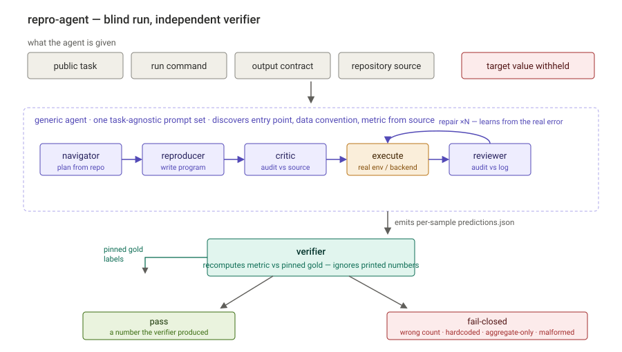

# Repro-Agent

[English](README.md) | [中文](README.zh-CN.md)

A **research prototype** of a blind, multi-agent **reproduction benchmark +
runtime** for ML results. A team of role-specialized LLM agents inspects a repo,
writes and executes an evaluation program with **native tool calling**,
**self-corrects from real execution failures**, and is graded by an
**independent, fail-closed evaluation harness** that recomputes the metric from
per-sample outputs — the agent never sees the target number.

Scope is honest: this is prototype-scale N=5 evidence across six development
tasks plus one post-freeze held-out repository, not a battle-tested universal
runtime. See [Scope / Limitations](#scope--limitations).

Orchestrated with **LangGraph** (workflow stages plus a conditional repair loop);
the retrieval, failure-classified repair, sandboxed execution, and
blind verifier are implemented directly on a provider-agnostic OpenAI-compatible
API. Selected tool capabilities are also exposed over **MCP** for external clients.

| Evidence | Result |
|---|---:|
| Fresh full-pipeline coverage across 6 tasks | **27 verified passes / 30 runs** |
| Four-task ablation, `solo` → `solo-repair` → `full` | **7/20 → 14/20 → 17/20 verified** |
| Hardest task (OpenOOD), `solo` → `full` | **0/5 → 4/5 verified** |
| Post-freeze held-out repo: Sentence-Transformers STS-B | **5/5 verified, 5/5 workflow-clean** |



## What this project demonstrates

| Capability | What it is here | Where |
|---|---|---|
| **Multi-agent orchestration (LangGraph)** | A `StateGraph` routes navigation, generation, critique, execution, and repair; in `full` mode each execution is independently reviewed before repair | [`agent/pipeline.py`](agent/pipeline.py) |
| **Tool use / function calling** | Native OpenAI function-calling agent loop with sequential tool dispatch | [`agent/loop.py`](agent/loop.py) |
| **Tool interoperability (MCP)** | Repo search and restricted diagnostic/command interfaces exposed separately over the Model Context Protocol | [`mcp_server.py`](mcp_server.py) |
| **Self-correction (Reflexion-style)** | A failure-classified, execution-grounded repair loop; patch-first edits over blind regeneration | [`agent/repair.py`](agent/repair.py), [`agent/failure.py`](agent/failure.py) |
| **RAG / retrieval** | Repo-navigation retrieval: BM25 lexical search + path/symbol signals + LLM reranking + dynamic query rewriting | [`retrieval/`](retrieval/) |
| **LLM evaluation & guardrails** | Blind, fail-closed verifier that recomputes metrics from per-sample artifacts while hidden targets/gold stay outside agent context | [`verify/`](verify/) |
| **Isolated code execution** | Subprocess sessions plus optional resource-limited Docker sessions with network cutoff | [`exec/`](exec/) |
| **Observability** | Per-call token + cost accounting, full transcripts, and replayable command scripts | [`agent/llm.py`](agent/llm.py) |
| **Evaluation methodology** | Budget-fair repeated-run ablation across orchestration depths, mean cost, and failure-mode breakdown | [`evals/`](evals/) |
| **Declarative task onboarding** | Standard tasks load an Oracle-side YAML manifest into the existing `OracleConfig`; uncommon setup or grading can use explicit hooks | [`evals/manifest.py`](evals/manifest.py), [`evals/tasks/`](evals/tasks/) |
| **Deterministic agent testing** | `ScriptedLLM` drives the whole control flow with no API/tokens for fast, reproducible tests | [`tests/`](tests/) |

Stack: Python, **LangGraph**, **MCP** (Model Context Protocol), OpenAI-compatible
function calling (provider-agnostic; runs on DeepSeek/any OpenAI-style endpoint),
BM25 retrieval, Docker, `pytest`.

Task-manifest schema, privacy boundary, hooks, and current limits are documented
in [Declarative Oracle Manifests](docs/task-manifests.md).

### Recommended code-reading order

1. [`evals/tasks/sentence_transformers_stsb.yaml`](evals/tasks/sentence_transformers_stsb.yaml) and [`evals/manifest.py`](evals/manifest.py) — a declarative standard task and the factory that creates `OracleConfig`.
2. [`agent/types.py`](agent/types.py) — the runtime contract produced by the factory.
3. [`agent/pipeline.py`](agent/pipeline.py) — LangGraph nodes, routes, and the repair loop.
4. [`agent/roles.py`](agent/roles.py) and [`agent/loop.py`](agent/loop.py) — role tools and the shared function-calling loop.
5. [`agent/failure.py`](agent/failure.py), [`agent/repair.py`](agent/repair.py), and [`verify/check.py`](verify/check.py) — diagnosis, patching, and final grading.

## Pipeline

```text
public task + repo + output contract
        │
        ▼
Navigator ──handoff──▶ Reproducer ──program──▶ Critic
        │                              │          │
        └──── repo-navigation RAG ◀────┴──────────┘
                                      │
                                      ▼
                              execute program
                                      │
                    stdout/stderr + public verifier diagnostics
                                      │
                                      ▼
                              Reviewer / Repair loop
                                      │
                                      ▼
                         per-sample artifact + result.json
                                      │
                                      ▼
                         fail-closed metric recomputation
```

| Role | Context boundary | Responsibility |
|---|---|---|
| Navigator | public task, repo snippets, retrieved evidence | Find entry points, assets, metric semantics, and unresolved risks. |
| Reproducer | public task, navigator handoff, retrieved source | Write the complete evaluation script and output per-sample predictions. |
| Critic | generated code, source evidence | Audit code before execution without seeing verifier gold or target values. |
| Reviewer | code, execution log, public verifier diagnostics | Independently audit the implementation and execution evidence for Repair. |
| Repair | previous code, failure summary, selected evidence | Patch the existing script, avoiding blind regeneration and duplicate retries. |

**Context engineering:** each role starts from a fresh LLM context instead of inheriting the full chat history, which keeps prompts focused and bounds token growth. **Retrieval (RAG)** is repo-navigation oriented: BM25 lexical search, path/symbol signals, source snippets, optional LLM rerank, and dynamic query rewriting generated from the current uncertainty, code, and failure logs.

## Self-Correction: Failure-Grounded Repair Loop

The repair loop is a Reflexion-style self-correction mechanism. A deterministic rule-based classifier over stdout/stderr and verifier diagnostics produces a compact failure summary and may suggest restricted runtime probes; the Repair LLM performs the source-grounded diagnosis and edit.

Runtime probes are soft hints, not mandatory gates: repairs may skip probing when source evidence is sufficient. The default repair policy is patch-first, with full-file replacement only as a fallback.

## Evaluation Harness & Guardrails (the Verifier)

The agent context and provisioned workspace omit the hidden target metric. It must write a public artifact with per-sample predictions; the verifier loads pinned gold labels and recomputes the metric independently. Aggregate-only guessing or echoing the published number cannot pass this contract.

Fail-closed cases include missing artifact, malformed JSONL/CSV, wrong sample count, aggregate-only output, non-recomputable predictions, and values outside tolerance. Public diagnostics can be fed back to Reviewer/Repair, but hidden expected values are not exposed to the agent workspace.

`recompute_fn` is the only grading path: every verdict is a fresh metric computed from per-sample outputs against pinned gold. There is no aggregate-score or code-shape fallback.

## Observability

Every LLM call accumulates token usage and cost (with cache-hit accounting), so a
run's cost is a delta of two snapshots. Each run emits the full per-role
transcript, RAG/probe traces, and a replayable `commands.sh`, making any verdict
auditable and reproducible after the fact.

## MCP Server

Selected capabilities are exposed separately over the **Model Context Protocol**
in [`mcp_server.py`](mcp_server.py), so an MCP client can call repository search,
restricted probes, and temporary-directory command execution. The main pipeline
still uses native function calling and task-specific Session/Docker execution; it
does not route its tools through MCP.

```bash
python mcp_server.py   # stdio transport
```

> The MCP command tool uses a fresh temporary working directory and a subprocess;
> it is not the pipeline's optional Docker backend. Neither should be treated as a
> hardened security boundary against malicious code.

## Experiment Results

Current summarized results live in [evals/RESULTS.md](evals/RESULTS.md). The
reportable evaluation contains 75 DeepSeek V4 Flash runs: 70 development-task
runs plus a post-freeze Sentence-Transformers held-out full-pipeline N=5 cell.
An earlier five-run holdout pilot is disclosed but excluded because the new
Oracle adapter falsely rejected valid CLI output-path code.

## Pipeline Ablation

All conditions use the same generic prompts, verifier, and execution budget; they differ only in orchestration depth and whether execution feedback is used.

| Condition | Roles | Execution feedback | Purpose |
|---|---|---|---|
| `solo` | Reproducer | no repair | Baseline one-shot code generation. |
| `solo-repair` | Reproducer + Repair | real logs + diagnostics | Isolate execution-grounded repair. |
| `full` | Navigator + Reproducer + Critic + Reviewer + Repair | real logs + diagnostics | Configurable collaboration mode, not assumed to be always best. |

Across four tasks, verified success rises from `solo` 7/20 to `solo-repair`
14/20 and `full` 17/20. Full collaboration is still not universally strongest:
among its 17 verifier-accepted runs, 12/17 (70.6%) had no workflow error because
extra Reviewer/handoff steps can fail after valid inference. The corresponding
conditional rates are 7/7 for `solo` and 14/14 for `solo-repair`. Detailed
tables, cost, and failure analysis are in [evals/RESULTS.md](evals/RESULTS.md).

## Run

```bash
python -m venv .venv && source .venv/bin/activate
pip install -r requirements.txt
```

```bash
export LLM_API_KEY=...
export LLM_BASE_URL=...
export LLM_MODEL=deepseek-v4-flash
export LLM_THINKING=disabled
```

```bash
python run_distilbert_multi_rag.py
PIPELINE=solo-repair python run_openood_multi_rag.py
PIPELINE=full python run_robustbench_multi_rag.py
```

Prepare and run the held-out Sentence-Transformers task:

```bash
.venv-oracle/bin/python scripts/prepare_sentence_transformers_stsb.py
.venv/bin/python scripts/run_holdout_n5.py --batch holdout_v2_n5
```

OpenOOD defaults to the offline Docker/CPU backend. On Apple Silicon, a faster
host-MPS backend is available for trusted, human-reviewed checkouts:

```bash
.venv-oracle/bin/pip install --target repos/OpenOOD/.mps-site numpy==1.26.4
OPENOOD_EXECUTION_BACKEND=mps PIPELINE=solo-repair python run_openood_multi_rag.py
```

The MPS backend keeps the blind workspace, clean secret-free subprocess
environment, full sample contract, and independent verifier. It does not provide
Docker's container or network isolation, so its backend is recorded in every new
run artifact and benchmark manifest.

Tests — the unit suite needs no LLM/Docker/network and runs in ~1s:

```bash
pytest                 # fast unit suite (integration tests deselected by default)
pytest -m integration  # Docker-dependent tests (needs a live daemon)
```

Useful paths:

- `agent/pipeline.py` — top-level orchestration state machine and execution/repair loop.
- `agent/contracts.py` — public task context and generic code/report/review validators.
- `agent/types.py` — shared task/runtime configuration types.
- `agent/repair.py` — patch-first repair and repair validation.
- `agent/diagnostics.py` — generic public-contract diagnostics.
- `agent/runtime_probe.py` — restricted import/signature/path/CLI probes.
- `agent/generic_prompts.py` — task-agnostic role prompts.
- `agent/failure.py` — failure classification and probe suggestions.
- `retrieval/` — repo-navigation search and snippet extraction.
- `exec/` — subprocess/Docker execution sessions.
- `verify/` — fail-closed metric recomputation.
- `evals/manifest.py` and `evals/tasks/` — declarative standard-task onboarding.
- `evals/oracles/` — thin manifest wrappers and custom adapters for exceptional tasks.

## Scope / Limitations

Stated plainly, so the claims don't outrun the evidence:

- **Prototype-scale evaluation.** The main ablation covers four tasks × three
  conditions at N=5, and full-pipeline coverage spans six tasks at N=5. There are
  no confidence intervals. One post-freeze held-out repository adds direct
  generalization evidence, but one task is not a representative held-out set;
  treat the numbers as prototype evidence, not a benchmark verdict.
- **Task onboarding is declarative, not zero-config.** Standard local/JSON-object-list tasks
  can be added with an Oracle-side YAML manifest; unusual execution backends, workspace
  layouts, or grading semantics still require a small provisioning or verifier
  hook. Existing complex benchmarks have not all been migrated. This is not
  zero-config reproduction of arbitrary repositories.
- **The failure classifier is rule-based.** It is an execution-grounded *regex/rule*
  classifier over stdout/stderr/diagnostics that builds repair context for the LLM
  — not an "intelligent" auto-diagnoser. The reasoning lives in the repair agent.
- **Retrieval is not optimized for scale.** Each search re-scans the repo
  (`load_corpus` walks the tree); there is no caching or incremental indexing, so
  very large repos would need work before this is production-grade.
- **Isolation, not a security sandbox.** This is an experiment-integrity runtime
  for cooperative agents. The verifier rejects unverifiable outputs; workspace
  provisioning keeps targets/gold outside agent context. Execution runs in an
  isolated workdir (optionally Docker with network cutoff). Host-MPS execution is
  faster but weaker, and neither mode is proven adversary-proof.

Run artifacts under `evals/runs/`, `logs/`, `workspaces/`, and `repos/` are generated outputs. They are intentionally kept out of the main project narrative; summarized evidence and reproducibility metadata belong in `evals/RESULTS.md` and `evals/FREEZE.md`.
