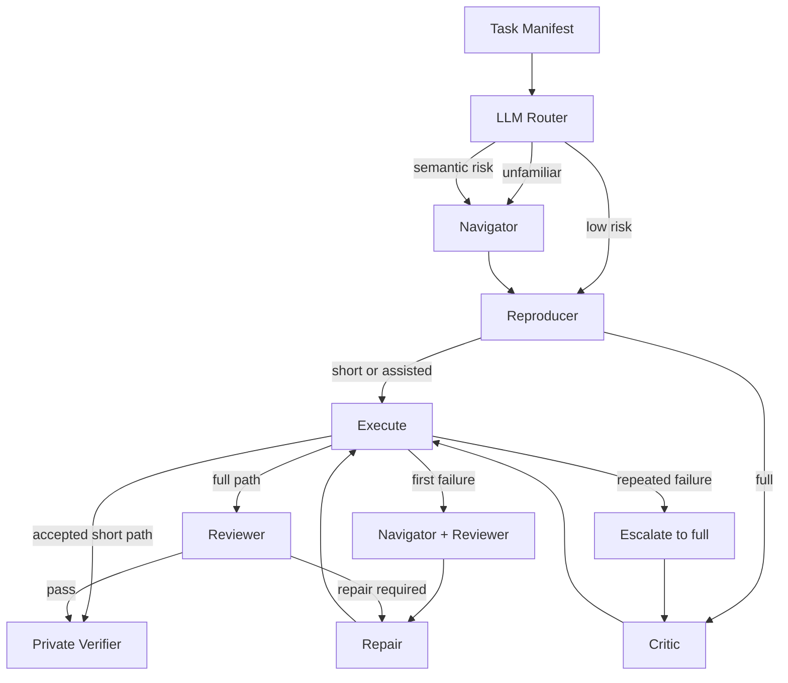

# Repro-Agent

[English](README.md) | [中文](README.zh-CN.md)

Repro-Agent is a blind, adaptive multi-agent runtime for reproducing machine
learning repository results. Agents receive only the public task and repository;
a private fail-closed verifier recomputes the metric from per-sample outputs.

## Adaptive Agent Architecture

Router selects the initial collaboration level. Navigator investigates unfamiliar
repositories, Reproducer writes the evaluation program, Critic checks risky code,
Reviewer diagnoses real executions, and Repair submits focused patches. Simple
tasks stay on the short path; failures progressively add roles and can escalate to
the full path. The private verifier runs only after the workflow and never exposes
gold labels or target metrics to agents.

## Adaptive N=5 Evaluation

The reported progressive `adaptive` snapshot was run five times on each of five
development tasks. `Workflow pass` requires both verifier acceptance and no
orchestration error.

| Repository / task | Selected path | Verifier pass | Workflow pass | Mean evaluations | Mean cost |
|---|---|---:|---:|---:|---:|
| DistilBERT / SST-2 | short | **5/5** | **5/5** | 1.0 | ¥0.0120 |
| detectors ResNet-18 / CIFAR-100 | assisted | **5/5** | **5/5** | 2.0 | ¥0.1273 |
| mmpretrain ResNet-18 / CIFAR-10 | full | **3/5** | **3/5** | 2.6 | ¥0.3349 |
| OpenOOD EBO / Near-OOD AUROC | full | **1/5** | **1/5** | 3.2 | ¥0.5347 |
| RobustBench Carmon2019 | full | **4/5** | **3/5** | 2.8 | ¥0.4784 |
| **Total / mean** | - | **18/25 (72%)** | **17/25 (68%)** | **2.32** | **¥0.2975** |

The Router keeps the easy task cheap and escalates recoverable failures, but
semantic correctness on OpenOOD and structured Repair submission remain the
main limitations. These five tasks informed development and are not held-out
generalization evidence.

## Held-Out Evaluation

| Held-out repository/task | Pipeline | Verifier | Workflow clean |
|---|---|---:|---:|
| Sentence-Transformers STS-B | frozen `full` | **5/5** | **5/5** |
| OpenAI CLIP ViT-B/32 on CIFAR-10 | manifest-only `adaptive` | **5/5** | **2/5** |

Both repositories were selected after the corresponding runtime was frozen. The
CLIP task required only a YAML manifest and no task-specific hook. Exact runs,
exclusions, commits, and asset hashes are recorded in
[evals/RESULTS.md](evals/RESULTS.md) and [evals/FREEZE.md](evals/FREEZE.md).
