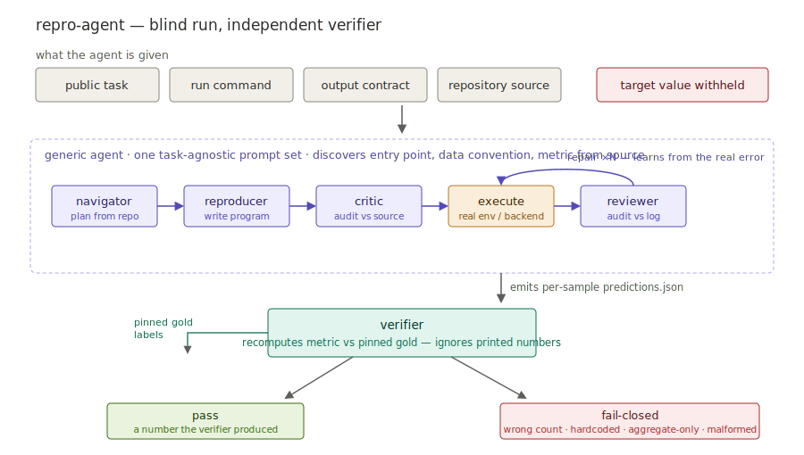

# Repro-Agent

[English](README.md) | [中文](README.zh-CN.md)

Repro-Agent 是一个面向代码仓库任务的**盲测多智能体运行时(blind multi-agent runtime)**。一队角色分工的 LLM 智能体在盲测条件下复现已发布的 ML 结果：用 **native tool calling** 自主读 repo、写评测脚本、执行、**从真实执行失败中自我修复(self-correction)**，最终由一个**独立、fail-closed 的评测器(evaluation harness)**从逐样本 artifact 重算指标——智能体全程看不到目标数字。

**从零手写**(agent loop、检索、修复循环、评测器都是在 provider-agnostic 的 OpenAI 兼容 API 上自实现的,**未依赖 LangChain/LangGraph**),目的是把一个 agentic 系统的内部机制讲清楚,而不是藏在框架背后。



## 本项目展示的能力(技术点对照)

| 能力 | 在本项目里是什么 | 位置 |
|---|---|---|
| **Multi-agent orchestration(多智能体编排)** | 角色分工的状态机(Navigator→Reproducer→Critic→执行→Reviewer→Repair),per-role 上下文隔离 | [`agent/pipeline.py`](agent/pipeline.py) |
| **Tool use / function calling(工具调用)** | 原生 OpenAI function-calling 的 agent loop、顺序工具派发、上下文压缩 | [`agent/loop.py`](agent/loop.py) |
| **Self-correction(Reflexion 式自我修复)** | 失败分类驱动、execution-grounded 的修复闭环,patch-first 优先于盲目重写 | [`agent/repair.py`](agent/repair.py)、[`agent/failure.py`](agent/failure.py) |
| **RAG / retrieval(检索增强)** | 面向代码仓库的检索:BM25 + 路径/符号信号 + LLM rerank + 动态 query rewriting | [`retrieval/`](retrieval/) |
| **LLM evaluation & guardrails(评测与护栏)** | 盲测、fail-closed 验证器,从逐样本 artifact 重算指标,拒绝不可复算/泄漏结果 | [`verify/`](verify/) |
| **Sandboxed execution(沙箱执行)** | subprocess + Docker 执行会话,两阶段网络隔离 | [`exec/`](exec/) |
| **Observability(可观测)** | per-call token + 成本核算、全链路 transcript、可复算 `commands.sh` | [`agent/llm.py`](agent/llm.py) |
| **Evaluation methodology(评测方法)** | budget-fair 消融、`pass@k`、平均成本、失败模式拆解 | [`evals/`](evals/) |
| **Deterministic agent testing(确定性测试)** | `ScriptedLLM` 零 API/token 驱动整条控制流,快速可复现 | [`tests/`](tests/) |

技术栈:Python、OpenAI 兼容 function calling(provider-agnostic,可跑 DeepSeek/任意 OpenAI 风格端点)、BM25 检索、Docker、`pytest`。

## 为什么不是普通 Agent Demo

很多“AI 复现论文”的 demo 最后只输出一个 aggregate 数字，例如 `accuracy=94.82%`。这个数字本身没有证明力：Agent 可能硬编码、抄 README、只跑部分样本，或者根本没做真实评测。

这个项目重点解决两个问题：

1. **可信性问题**：Agent 不能只汇报分数，必须输出逐样本预测/分数等 artifact；verifier 用隐藏 gold labels 或确定性规则自己重算指标。
2. **泛化问题**：不同仓库的入口、数据加载、checkpoint、preprocessing、metric 都不一样；如果每个任务都手写提示词，本质是在做数据录入，不是在做 Agent 系统。

## 核心设计

### 1. 盲测 + verifier 重算

Agent 从不看到目标值。它必须生成公开协议要求的结果文件，例如 `predictions.json`。Verifier 读取自己的隐藏标签或验收规则，重新计算指标。

因此以下情况都会 fail-closed：

- 只打印 aggregate 数字；
- 样本数不对；
- artifact 格式错误；
- 硬编码/伪造结果；
- 指标可重算但超过容差。

### 2. 通用角色提示词 + 公共任务规格

Agent 的角色 prompt、RAG、执行、修复逻辑是通用的。每个任务只定义：

- 公开任务描述；
- 公开执行命令；
- 公开 artifact contract；
- workspace 如何准备；
- verifier 如何隐藏地判分。

也就是说，任务规格只负责出题和阅卷，不给 Agent 注入解题提示。

## 系统架构

一次 run 是一个多角色 pipeline。每个角色都有独立 LLM 上下文和工具预算，避免一个角色的错误推理污染后续角色。

| 角色 | 职责 |
|---|---|
| **Navigator** | 阅读仓库，产出基于证据的执行计划：入口、数据/模型资产、metric 语义、未决问题。 |
| **Reproducer** | 根据公开任务、Navigator handoff 和检索到的源码，生成完整评测程序。 |
| **Critic** | 执行前审查代码是否符合仓库证据和 artifact contract。 |
| **execute** | 在真实 subprocess / Docker 环境中运行生成的评测脚本。 |
| **Reviewer** | 根据执行日志和 verifier 的公开诊断做 post-execution 审查。 |
| **Repair ×N** | 根据真实错误日志、失败分类和 public diagnostics 做 patch-first 修复并重跑。 |

### RAG repo navigation

这里的 RAG 不是默认依赖向量库，而是面向代码仓库的检索增强：

- BM25 lexical search；
- exact path / symbol signals；
- LLM rerank；
- query-centered source snippets。

Dense embedding 不是默认路径必须项。

### Tool use

系统提供受控工具：

- `search_repo`：在 workspace 源码中检索相关文件和片段；
- `runtime_probe`：受限运行时探针，用于 import smoke、函数签名、路径列表、CLI help；
- shell / Docker session：执行生成的评测脚本；
- verifier：从 artifact 中重算指标。

`runtime_probe` 是软建议，不是强制门槛。Failure classifier 可以建议 probe，但当源码证据足够时，Repair 可以直接提交。

### Self-correction:Failure classifier + patch-first repair

执行失败后，系统会先根据执行日志和 verifier diagnostics 分类：

- `import_error`
- `api_mismatch`
- `missing_path`
- `missing_artifact`
- `malformed_artifact`
- `semantic_mismatch`
- `timeout`
- `workflow_error`

分类结果会进入 Repair 上下文，指导下一步是 search、probe、patch 还是 full-file fallback。Repair 默认先提交精确 old/new patch，避免每轮全文件重写破坏已正确的代码；patch 不可用时再 fallback 到完整文件重写。

## Observability(可观测)

每次 LLM 调用都累计 token 用量和成本(含 cache-hit 计价),一次 run 的成本就是两次快照之差。每次 run 还会产出完整的逐角色 transcript、RAG/probe trace,以及可复算的 `commands.sh`,使任何判定结果事后都可审计、可复现。

## 实验结果

当前实验摘要放在 [evals/RESULTS.md](evals/RESULTS.md)。其中 E1 coverage
表保留为历史 N=5 摘要；当前 E2 消融只保留三种条件：
`solo`、`solo-repair`、`full`。

## Pipeline Conditions

所有条件使用同一套通用 role prompts 和相同执行预算（1 次初始执行 + 最多 4 次后续执行），区别只在编排深度和是否使用执行反馈。

- `solo`：只有 Reproducer，一次执行。
- `solo-repair`：Reproducer + Repair，根据真实执行错误修复，最多 5 次执行。
- `full`：Navigator + Reproducer + Critic + Reviewer + Repair，最多 5 次执行。

这个版本更适合作为项目展示：对比“一次生成”“执行反馈修复”“完整多角色协作”，避免过多消融条件让代码和讲解变复杂。

## 目录结构

- `agent/pipeline.py`：顶层编排状态机和执行/修复循环。
- `agent/contracts.py`：公共任务上下文和通用 code/report/review 校验。
- `agent/types.py`：task/runtime 共享配置类型。
- `agent/repair.py`：patch-first 修复和修复校验。
- `agent/diagnostics.py`：通用 public-contract diagnostics。
- `agent/runtime_probe.py`：受限 import/signature/path/CLI probe。
- `agent/generic_prompts.py`：任务无关的角色提示词。
- `agent/failure.py`：基于执行日志和 verifier diagnostics 的失败分类器。
- `retrieval/`：代码仓库检索和 snippet 提取。
- `exec/`：subprocess / Docker 执行会话。
- `verify/`：确定性验收和指标重算。
- `evals/oracles/`：每个任务的出题/阅卷配置。
- `run_*_multi_rag.py`：任务 runner，`PIPELINE` 选择实验条件。

## 安装

```bash
python -m venv .venv && source .venv/bin/activate
pip install -r requirements.txt
```

配置聊天模型：

```bash
LLM_API_KEY=...
LLM_BASE_URL=...
LLM_MODEL=...
```

部分任务需要本地预置模型、数据集缓存或 Docker 镜像，具体见对应的 `evals/oracles/` 文件。

## 运行

```bash
python run_distilbert_multi_rag.py
PIPELINE=solo-repair python run_openood_multi_rag.py
PIPELINE=full python run_robustbench_multi_rag.py
pytest -q
```

## 项目边界

这是一个面向 cooperative runs 的实验完整性检查系统，不是对抗恶意 Agent 的安全沙箱。Verifier 能拒绝缺失、格式错误、样本数错误、aggregate-only 或不可重算输出，并从公开 artifact 重算指标；但它不保证抵御所有恶意代码或数据泄漏攻击。

更准确地说，本项目的 claim 不是“任意 repo 零配置自动复现”，而是：

> 给定公开任务、运行命令、artifact contract 和隐藏 verifier 资产后，同一套 generic multi-agent runtime 能自动读 repo、写评测脚本、执行、修复，并由 verifier 做 fail-closed 验收。
