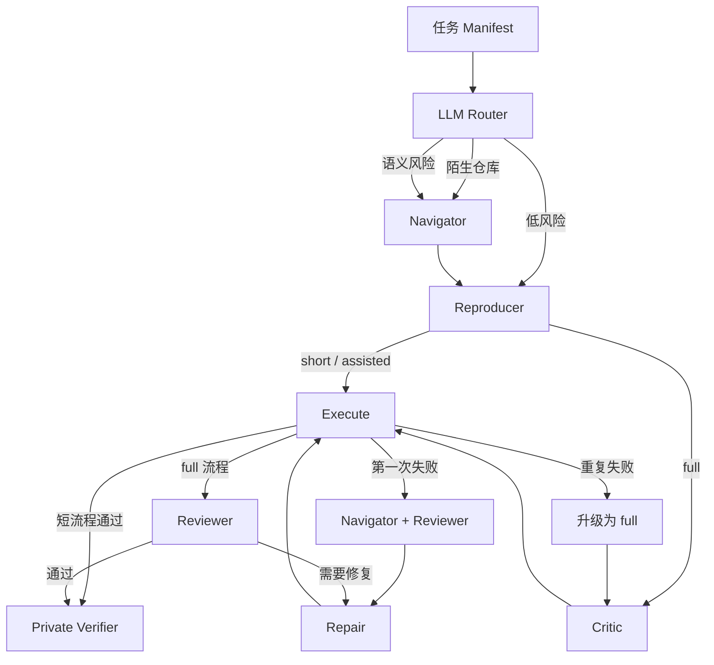

# Repro-Agent

[English](README.md) | [中文](README.zh-CN.md)

Repro-Agent 是一个面向机器学习代码仓库的盲测自适应多智能体复现框架。Agent
只能看到公开任务和代码仓库；私有 fail-closed verifier 根据逐样本输出独立重算指标。

## Agent 结构

```mermaid
flowchart TD
    T["任务 Manifest"] --> R["LLM Router"]
    R -->|低风险| P["Reproducer"]
    R -->|陌生仓库| N["Navigator"]
    R -->|语义风险| N
    N --> P
    P -->|short / assisted| E["Execute"]
    P -->|full| C["Critic"]
    C --> E
    E -->|第一次失败| D["Navigator + Reviewer"]
    D --> X["Repair"]
    X --> E
    E -->|重复失败| F["升级为 full"]
    F --> C
    E -->|短流程通过| V["Private Verifier"]
    E -->|full 流程| W["Reviewer"]
    W -->|通过| V
    W -->|需要修复| X
```

Router 决定初始协作级别；Navigator 调研陌生仓库；Reproducer 编写评测程序；
Critic 审查高风险代码；Reviewer 分析真实执行结果；Repair 提交局部补丁。简单任务
保持短流程，失败后逐步增加角色，重复失败时升级为 full。Private Verifier 只在流程
结束后运行，gold labels 和目标指标不会进入 Agent 上下文。

## Adaptive N=5 实验

本次渐进式 `adaptive` 快照在 5 个开发任务上各独立运行 5 次。“流程完整通过”要求
Verifier 接受结果，并且整个 Agent 流程没有编排异常。

| 仓库 / 任务 | 实际路径 |    Verifier 通过 |     流程完整通过 | 平均评测次数 | 平均成本 |
|---|---|-----------------:|-----------------:|---:|---:|
| DistilBERT / SST-2 | short |          **5/5** |          **5/5** | 1.0 | ¥0.0120 |
| detectors ResNet-18 / CIFAR-100 | assisted |          **5/5** |          **5/5** | 2.0 | ¥0.1273 |
| mmpretrain ResNet-18 / CIFAR-10 | full |          **3/5** |          **3/5** | 2.6 | ¥0.3349 |
| OpenOOD EBO / Near-OOD AUROC | full |          **2/5** |          **2/5** | 3.2 | ¥0.5347 |
| RobustBench Carmon2019 | full |          **4/5** |          **3/5** | 2.8 | ¥0.4784 |
| **总计 / 平均** | - | **18/25（72%）** | **17/25（68%）** | **2.32** | **¥0.2975** |

Router 能让简单任务保持低成本，也能升级部分可修复失败；当前主要不足是 OpenOOD
上的语义正确性，以及 Repair 的结构化提交稳定性。这 5 个任务参与过系统开发，不能
作为未见任务泛化证据。

## Held-Out 实验

| 新仓库 / 任务 | 流程 | Verifier | 流程完整 |
|---|---|---:|---:|
| Sentence-Transformers STS-B | 冻结版 `full` | **5/5** | **5/5** |
| OpenAI CLIP ViT-B/32 / CIFAR-10 | 仅 Manifest 的 `adaptive` | **5/5** | **2/5** |

两个仓库都在对应运行时冻结后才选定。CLIP 只新增一份 YAML Manifest，没有编写
任务专用 Hook。完整运行、排除项、commit 和资产哈希记录在
[evals/RESULTS.md](evals/RESULTS.md) 与 [evals/FREEZE.md](evals/FREEZE.md)。
