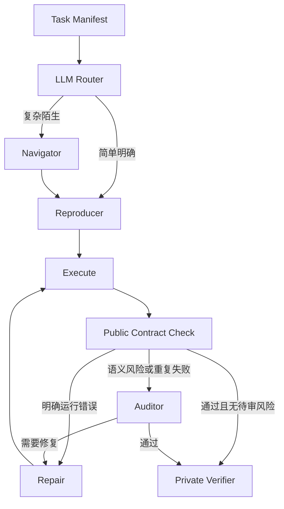

# Repro-Agent

[English](README.md) | [中文](README.zh-CN.md)

Repro-Agent 是一个面向机器学习代码仓库的**盲测自适应多智能体复现框架**。Agent 读取公开任务和仓库，生成评测脚本，在真实环境中执行并根据失败日志修复；最终 verifier 从逐样本输出重新计算指标。目标值和 gold labels 不进入 Agent 上下文。

当前产品代码只有一条 `adaptive` 流程。历史 `solo / solo-repair / full` 仅作为消融实验，说明为什么需要执行反馈、角色分工和按需编排，不再作为运行选项。

| 历史实验依据 | 结果 |
|---|---:|
| `solo` → `solo-repair` → `full` | **7/20 → 14/20 → 17/20** verifier 通过 |
| OpenOOD：`solo` → `full` | **0/5 → 4/5** verifier 通过 |
| 6 项任务 full coverage | **27/30** verifier 通过 |
| 冻结后 STS-B held-out | **5/5** verifier 通过且无流程异常 |
| Manifest-only adaptive CLIP held-out | **5/5** verifier 通过；**2/5** 无流程异常 |

完整结果、成本和失败分析见 [evals/RESULTS.md](evals/RESULTS.md)。旧流水线代码归档在 Git tag `legacy-pipelines-v1`，正式实验的 commit、补丁哈希和资产版本见 [evals/FREEZE.md](evals/FREEZE.md)。

## 当前架构


```mermaid
flowchart TD
    M["Task Manifest"] --> R["LLM Router"]
    R -->|简单明确| P["Reproducer"]
    R -->|复杂陌生| N["Navigator"]
    N --> P
    P --> E["Execute"]
    E --> C["Public Contract Check"]
    C -->|明确运行错误| X["Repair"]
    C -->|语义风险或重复失败| A["Auditor"]
    A -->|需要修复| X
    X --> E
    C -->|通过且无待审风险| V["Private Verifier"]
    A -->|通过| V
```

### 自适应编排

- **Router**：一次 Function Calling 提交结构化风险计划；规则在无效输出时兜底。
- **Navigator**：只在陌生仓库或高风险任务中检索入口、资产和指标语义。
- **Reproducer**：生成完整评测脚本和逐样本结果。
- **Auditor**：只在语义风险、未知错误或重复失败时检查源码证据。
- **Repair**：根据真实日志和公开 diagnostics 优先提交小 patch，最多执行五次。
- **Verifier**：流程结束后才读取私有 gold，独立重算一次指标。

LangGraph State 只保存路由所需的轮次、失败类型和 artifact 路径；完整脚本、日志、handoff 和 trace 保存在隔离 workdir，便于审计。

### Manifest 驱动任务接入

所有任务都从 `evals/tasks/*.yaml` 进入统一的 [evals/catalog.py](evals/catalog.py) 和 [evals/manifest.py](evals/manifest.py)。公共框架已经支持选择性资源复制、copy/symlink 挂载、目标值脱敏、本地/Docker 执行 profile、标量与嵌套输出、常用指标、grouped AUROC 和 gold 切片：

| 任务 | Manifest 负责 | 可选 Hook 负责 |
|---|---|---|
| Sentence-Transformers STS-B | 仓库、模型、JSONL、Spearman | 无 |
| DistilBERT SST-2 | 任务、输出、accuracy、缓存环境 | 生成脱敏 model card |
| detectors RN18 / VGG16 | 任务、类别范围、accuracy | model card 脱敏 |
| mmpretrain | 选择性资源、Docker、percentage accuracy | 无 |
| RobustBench | 缓存软链接、gold 切片、robust accuracy | 无 |
| OpenOOD | 选择性资源、Docker/MPS profile、嵌套分数、grouped AUROC 和方向检查 | 无 |
| OpenAI CLIP ViT-B/32 | 固定仓库/模型/数据、宿主 MPS、accuracy | 无 |

标准任务只填写 YAML；特殊任务通过小型 `provision/session/public_check/verifier` hook 扩展。Hook 在 Oracle 侧运行，不是 LLM 工具，也不会把隐藏值交给 Agent。字段和边界见 [docs/task-manifests.md](docs/task-manifests.md)。

## 为什么需要独立 Verifier

Agent 不能只打印 `accuracy=94.82`。它必须写出 `predictions.json` 等逐样本 artifact。系统会 fail-closed 地拒绝：

- artifact 缺失或格式错误；
- 样本数、顺序、字段或数值范围错误；
- 只输出 aggregate 数字；
- 私有 verifier 重算结果超出容差。

Repair 只能看到执行日志、公开格式检查和公开语义约束。`expected`、hidden gold 和私有重算结果不会进入修复循环。

## Agent 工具

- `search_repo`：BM25 + 路径/符号信号 + snippet + 可选 LLM rerank。
- `runtime_probe`：受限检查 import、函数签名、路径和 CLI help。
- `submit_handoff / submit_code / submit_audit / submit_patch`：角色提交结构化工作结果。
- Session / Docker：执行生成脚本并记录完整命令、stdout、stderr 和耗时。

仓库检索、probe 和临时目录命令也通过 [mcp_server.py](mcp_server.py) 暴露给 Claude Code、Cursor 等 MCP Client。主 pipeline 使用原生 Function Calling，不依赖 MCP 调度内部角色。

## 代码阅读顺序

1. [evals/tasks/openood_ebo.yaml](evals/tasks/openood_ebo.yaml)：复杂任务如何声明。
2. [evals/catalog.py](evals/catalog.py) 与 [evals/manifest.py](evals/manifest.py)：manifest 如何生成 `OracleConfig`。
3. [evals/assets.py](evals/assets.py)、[evals/execution.py](evals/execution.py)、[evals/metrics.py](evals/metrics.py) 与 [evals/grouped_scores.py](evals/grouped_scores.py)：公共资源、后端和指标。
4. [evals/hooks/](evals/hooks/)：只有特殊行为才写 Python。
5. [agent/pipeline.py](agent/pipeline.py)：唯一 adaptive LangGraph。
6. [agent/roles.py](agent/roles.py) 与 [agent/loop.py](agent/loop.py)：Function Calling 工具循环。
7. [agent/failure.py](agent/failure.py)、[agent/repair.py](agent/repair.py)、[verify/check.py](verify/check.py)：诊断、patch 与最终判卷。

更适合初学者的入口见 [docs/learning-guide.zh-CN.md](docs/learning-guide.zh-CN.md)。

## 运行

```bash
python -m venv .venv
source .venv/bin/activate
pip install -r requirements.txt
```

```bash
export LLM_API_KEY=...
export LLM_BASE_URL=...
export LLM_MODEL=deepseek-v4-flash
export LLM_THINKING=disabled
```

所有 runner 默认执行 adaptive：

```bash
python run_distilbert_multi_rag.py
python run_openood_multi_rag.py
python run_robustbench_multi_rag.py
python run_clip_vitb32_cifar10.py
```

OpenOOD 默认使用断网 Docker/CPU。可信仓库可在 Apple Silicon 上启用更快但隔离更弱的 MPS：

```bash
.venv-oracle/bin/pip install --target repos/OpenOOD/.mps-site numpy==1.26.4
OPENOOD_EXECUTION_BACKEND=mps python run_openood_multi_rag.py
```

测试不需要真实 LLM、网络或 Docker：

```bash
pytest -q tests --ignore=workspaces --ignore=repos
```

## 项目边界

- 历史消融是原型规模 N=5 证据，没有置信区间，不能证明 adaptive 统计上优于 full。
- adaptive 已在 OpenOOD 上完成开发验证，但该任务参与了设计迭代，不属于 held-out 泛化证据。
- 两个冻结后新仓库用于检验泛化；其中 CLIP 完全通过 Manifest 接入，
  verifier 为 5/5，但无流程异常仅 2/5，说明 Auditor 输出稳定性仍需改进。
- Manifest 是统一入口，不是任意仓库零配置；真正任务特有的资产发现或预处理仍可能需要短 hook。
- Failure classifier 是基于日志和 diagnostics 的规则分类器，真正推理发生在 Repair Agent。
- 本地 subprocess 和宿主 MPS 不是安全沙箱；Docker 提供资源与断网隔离，但也未证明能抵御恶意代码。
- 检索目前每次扫描仓库，没有增量索引或大规模生产优化。
